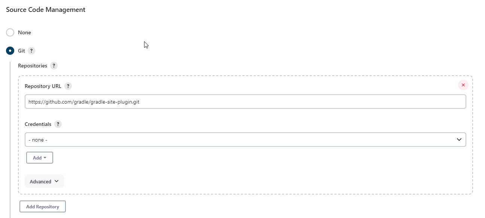
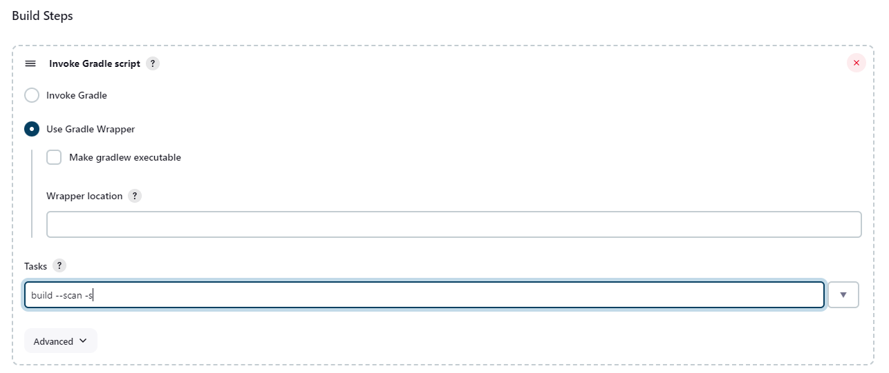
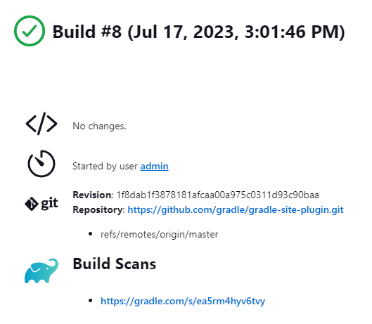

# Executing Gradle builds on Jenkins

!!! tip
    Top engineering teams using Jenkins have been able to reduce CI build time by up to 90% by using the Gradle Build Cache. [Register here](https://gradle.org/training/#build-cache-deep-dive) for our Build Cache training session to learn how your team can achieve similar results.

Building Gradle projects doesn't stop with the developer's machine. [Continuous Integration](https://en.wikipedia.org/wiki/Continuous_integration) (CI) has been a long-established practice for running a build for every single change committed to version control to tighten the feedback loop.

In this guide, we'll discuss how to configure [Jenkins](https://jenkins.io/) for a typical Gradle project.

## What you'll need

- A text editor
- A command prompt
- The Java Development Kit (JDK), version 1.7 or higher
- A Jenkins installation (setup steps explained in this post)

## Setup a typical project

As an example, this guide is going to focus on a Java-based project. More specifically, a Gradle plugin written in Java and tested with [Spek](https://www.spekframework.org/). First, we'll get the project set up on your local machine before covering the same steps on CI.

Just follow these steps:

### Clone the [Gradle Site Plugin](https://github.com/gradle/gradle-site-plugin) repository

```bash
$ git clone https://github.com/gradle/gradle-site-plugin.git
Cloning into 'gradle-site-plugin'...
$ cd gradle-site-plugin
```

### Build the project

As a developer of a Java project, you'll typically want to compile the source code, run the tests, and assemble the JAR artifact. That's no different for Gradle plugins. The following command achieves exactly that:

```bash
$ ./gradlew build

BUILD SUCCESSFUL
14 actionable tasks: 14 executed
```

The project provides the [Gradle Wrapper](gradle_wrapper.adoc#gradle_wrapper_reference) as part of the repository. It is a recommended practice for any Gradle project as it enables your project to be built on CI without having to install the Gradle runtime.

### Build scan integration

The sample project is equipped with support for generating [build scans](https://scans.gradle.com/). Running the build with the command line option `--scan` renders a link in the console.

```bash
$ ./gradlew build --scan

Publishing build scan...
https://gradle.com/s/7mtynxxmesdio
```

The following section will describe how to build the project with the help of Jenkins.

## Setup Jenkins

Jenkins is one of the most prominent players in the field. In the course of this section, you'll learn how to set up Jenkins, configure a job to pull the source code from GitHub, and run the Gradle build.

### Install and start Jenkins

On the [Jenkins website](https://jenkins.io/download/), you can pick from a variety of distributions. This post uses the runnable WAR file. A simple Java command brings up the Jenkins server.

```bash
$ wget https://mirrors.jenkins.io/war-stable/latest/jenkins.war
$ java -jar jenkins.war
```

In the browser, navigate to `localhost` with port `8080` to render the Jenkins dashboard. You will be asked to set up a new administration user and which plugins to install.

### Installation of plugins

Confirm to install the recommended plugins when starting Jenkins for the first time. Under "Manage Jenkins > Manage Plugins," ensure that you have the following two plugins installed:

- [Git plugin](https://plugins.jenkins.io/git)
- [Gradle plugin](https://plugins.jenkins.io/gradle)

Next, we can set up the job for building the project.

## Create a Jenkins job

Setting up a new Gradle job can be achieved with just a couple of clicks. From the left navigation bar, select "New Item > Freestyle project". Enter a new name for the project. We'll pick "gradle-site-plugin" for the project.

Select the radio button "Git" in the section "Source Code Management". Enter the URL of the GitHub repository: `https://github.com/gradle/gradle-site-plugin.git`.



Furthermore, create a "Build step" in the section "Build" by selecting "Invoke Gradle script". As mentioned before, we'll want to use the Wrapper to execute the build. In the "Tasks" input box, enter `build` and use the "Switches" `--scan -s` to generate a build scan and render a stack trace in case of a build failure.



### Execute the job

Save the configuration of the job and execute an initial build by triggering the "Build Now" button. The build should finish successfully and render a "Gradle Build Scan" icon that brings you directly to the [build scan](https://scans.gradle.com) for the given build.



There are various options to trigger Jenkins builds continuously: from polling the repository periodically, to building on a set schedule, or via callback URL.

## Further reading

You can learn more about advanced Jenkins usage through these resources:

- [Using credentials with Jenkins](https://jenkins.io/doc/book/using/using-credentials/)
- [Pipeline as code with Jenkins](https://jenkins.io/solutions/pipeline/)
- [Modeling a Continuous Deployment pipeline for a Spring Boot application](https://bmuschko.com/blog/jenkins-build-pipeline/)

## Summary

Executing Gradle builds on CI can be set up and configured with just a handful of steps. The benefit of receiving fast feedback clearly speaks for itself. If you are not using Jenkins, no problem, many CI products tightly integrate with Gradle as a first-class citizen.