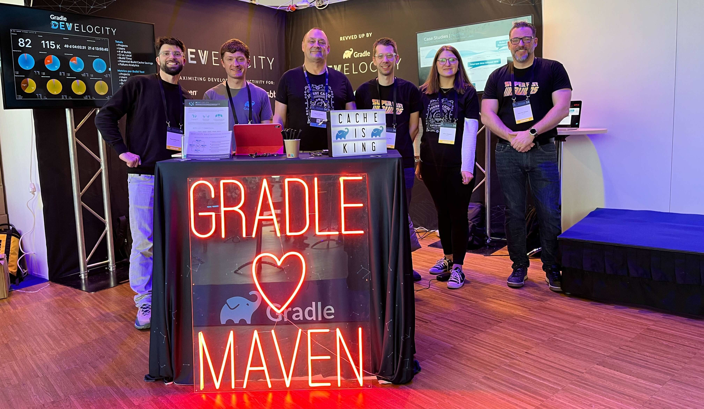

# Gradle Community Events

In Gradle, we organize multiple online events,
and also often attend Java and open source community conferences
like Devoxx or FOSDEM.
We are happy to meet at those events.

## Gradle Events Calendar

> Coming soon!

## Mentorship Programs

In Gradle, we participate in mentorship programs
and look for potential mentors and mentees to join us to
learn together and create something new for Gradle Build Tool or integrations.

### Google Summer of Code

[Google Summer of Code (GSoC)](https://summerofcode.withgoogle.com/) is a global,
online program focused on bringing new contributors into open source software development.
GSoC Contributors work with an open source organization on a 12+ week programming project
under the guidance of mentors.
Gradle has participated in GSoC since 2023.

See [Google Summer of Code](./gsoc/README.md) for more information

### Gradle Mentorship Program

The [Gradle Mentorship program](https://gradle.org/mentorship/)
links newer software engineers with Gradle Fellows to increase diversity in the Gradle community.

In 2022, we ran the first cohort with 6 mentees participating.
The program was open to everyone, but we prioritized mentees from underrepresented segments of the developer community, including women, and Black and Hispanic individuals,
who wanted support and professional development assistance from members of the Gradle Build Tool community.
Thanks to [Gradle Fellows](https://gradle.org/fellowship/) for mentoring!

We consider continuing this program in the future.

### Ad-hoc Mentorship

Even if there are no active mentorship programs in Gradle Build Tool,
we might be able to host something in the community for a particular initiative.
If you are a maintainer or an active contributor interested in doing mentorship,
reach out to us on the `#contributing` channel.

## Other Events

### Hacktoberfest

[Hacktoberfest](https://hacktoberfest.com/) is a month-long celebration of open-source projects, their maintainers, and the entire community of contributors.
Many component maintainers from the Gradle ecosystem, e.g. the
[Gradle plugin for Jenkins](https://plugins.jenkins.io/gradle),
already include their projects in Hacktoberfest.

In 2024, we plan to participate as an organization,
and to offer nice special-edition swag to the key contributors.

## Stay Informed

Subscribe to the [newsletter](https://newsletter.gradle.org/) for updates
about the upcoming community events and mentorship programs.
