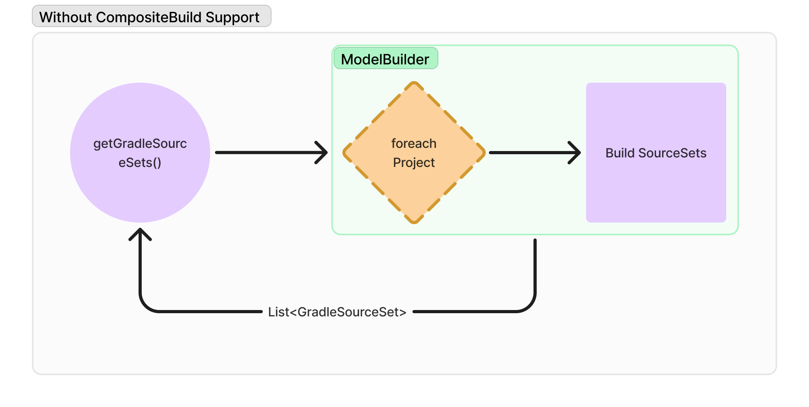
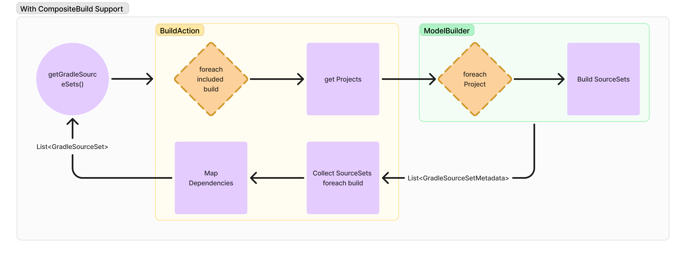
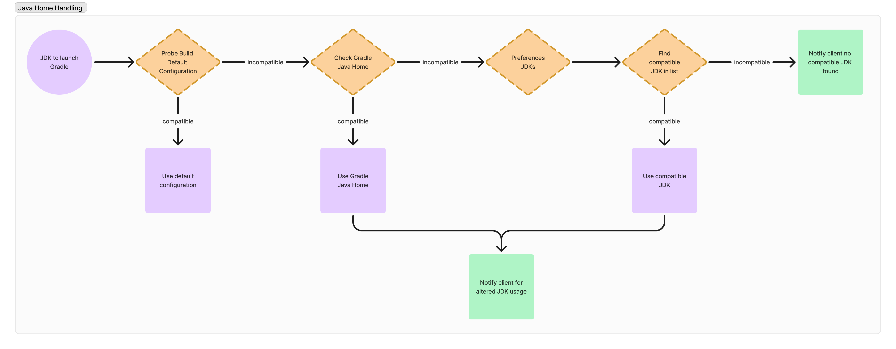
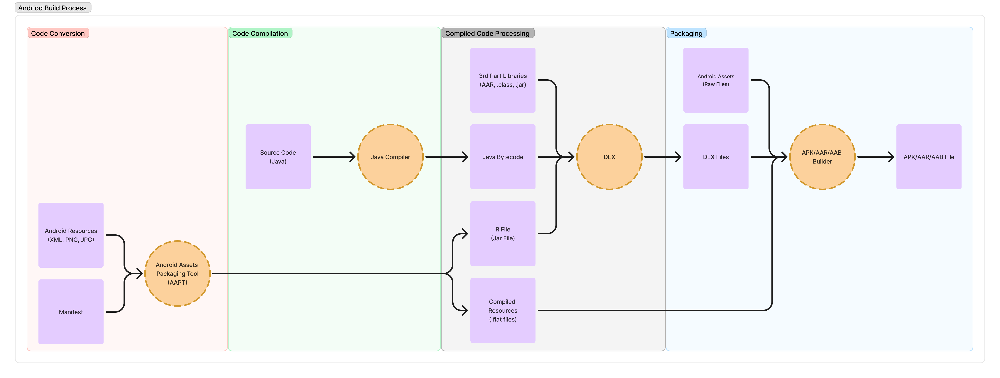
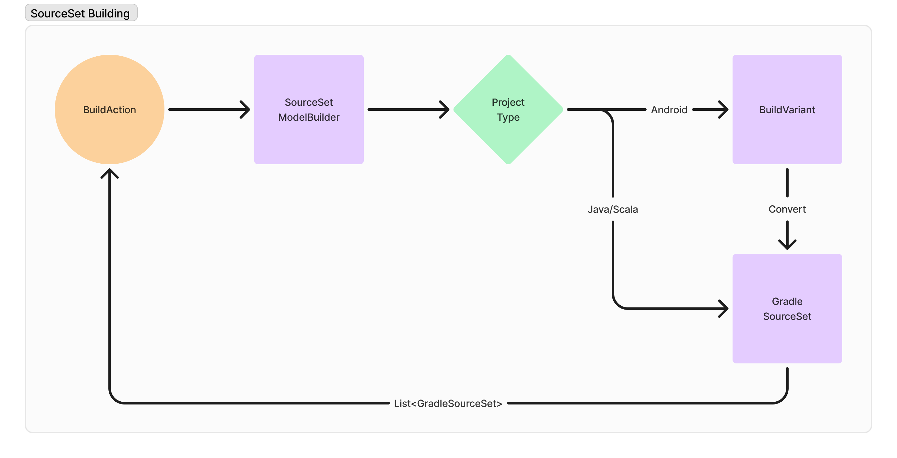

# GSoC 2024. Gradle Build Server – support for Android projects

This project aims to enhance [Gradle Build Server](https://github.com/microsoft/build-server-for-gradle) project from Microsoft by integrating powerful Android Studio features. Bridging the build process gap between [Android Studio](https://developer.android.com/studio) and [Gradle Build Server](https://github.com/microsoft/build-server-for-gradle), will significantly improve the development experience for many Android developers using Text Editors/IDEs which utilize the [Build Server Protocol (BSP)](https://build-server-protocol.github.io).

## Status
Passed mid-term evaluation with successful completion of composite build support, `JAVA_HOME` handling merged and Android support under review.

## Goal

1. Add support for composite builds. ([vscode-gradle issue #1435](https://github.com/microsoft/vscode-gradle/issues/1435))
2. Java Home detection and sending notification on incompatibility. ([issue #75](https://github.com/microsoft/build-server-for-gradle/issues/75) & [issue #76](https://github.com/microsoft/build-server-for-gradle/issues/76))
3. Add Android support with resolution of Android Java projects.

## Team

### Contributor

- [@Tanish-Ranjan](https://github.com/Tanish-Ranjan)

### Mentors

- [@donat](https://github.com/donat)
- [@hegyibalint](https://github.com/hegyibalint)
- [@jdneo](https://github.com/jdneo)
- [@reinsch82](https://github.com/reinsch82)
- [@oleg-nenashev](https://github.com/oleg-nenashev) as community advisor

## Rationale

As the popularity of Android development grows, the need for efficient build automation tools like the Gradle Build Server becomes increasingly important. However, current limitations in identifying and managing common Gradle functionalities used in Android projects within the server can hinder developer workflows. This project aims to bridge this gap by introducing functionalities specifically tailored to Android development.

## Deliverables

### Composite-Build Support ([vscode-gradle issue #1435](https://github.com/microsoft/vscode-gradle/issues/1435))

**Status:** Complete (Merged) 🟢

**Pull Requests:** [#154](https://github.com/microsoft/build-server-for-gradle/pull/154), [#160](https://github.com/microsoft/build-server-for-gradle/pull/160)

**Objectives:**

- Add support for building projects with [composite builds](https://docs.gradle.org/current/userguide/composite_builds.html).

**Pre-requisites:**

- Understanding Gradle API and Gradle Tooling API

**Implemented Features:**

- [x] Took over some work already done by [@Arthurm1](https://github.com/Arthurm1) in [PR#122](https://github.com/microsoft/build-server-for-gradle/pull/122), into [PR#154](https://github.com/microsoft/build-server-for-gradle/pull/154).
- [x] Utilized build actions to retrieve source sets from composite build projects which allowed for dependency susbtitution.
- [x] Fixed language extension downcast issue in [PR#160](https://github.com/microsoft/build-server-for-gradle/pull/160) which was breaking composite builds.

<b>Supporting Diagrams:</b>

### Improved Gradle Java Home Handling ([issue #75](https://github.com/microsoft/build-server-for-gradle/issues/75) and [issue #76](https://github.com/microsoft/build-server-for-gradle/issues/76))

**Status:** Complete (Merged) 🟢

**Pull Request:** [#165](https://github.com/microsoft/build-server-for-gradle/pull/165)

**Objectives:**

- Build the project with default configurations, if Java Home is incompatible try and find a suitable Java Home.
- If incompatible Java Home is detected notify client of the incompatibility. 

**Implemented Features:**

- [x] Probe build the project to find if default Java Home configuration is compatible.
- [x] In case of incompatibility try to find a compatible Java Home in the given order:
    1. GradleJavaHome (Gradle Properties)
    2. UserJavaHome (Retrieved from preferences)
- [x] Notify client if project's default Java Home was incompatible and we switched to a different Java Home for compatibility.
- [x] Notify client if the fallback logic couldn't find a compatible Java Home.

<b>Supporting Diagrams:</b>

### Android Java Project Support

**Status:** Complete (Under Review)🟡

**Pull Request:** [#173](https://github.com/microsoft/build-server-for-gradle/pull/173)

**Objectives:**

- Providing build targets for Android Java projects to the client

**Pre-requisites:**

- Understanding the entire Android build process and changes to the Android Gradle Plugin.

**Implemented Features:**

- [x] Extracted Build Variants and their properties from Android projects via reflection.
- [x] Populated GradleSourceSet (build target model) with build variant properties.
- [x] Provided Android SDK components and R file via dependency modules of the build target.

**Limitations:**

- Android generates a lot of intermediate sources such as AIDL, Render script, C/CPP, etc. Unfortunately AGP doesn't provide any APIs to retrieve these files. R.jar is one of these intermediate sources which is crucial for Android development so as a workaround I have retrieved the file using the process task for the build variant however, in some cases the task may not be registered during the sync in which case the dependency for R.jar is not provided. ([Issue #181](https://github.com/microsoft/build-server-for-gradle/issues/181))
- There various kinds of projects that come under Android development such as Application, Library, Instant App, Dynamic Modules, Android Test, etc. I have added support for the most commonly used projects - Application and Library but the current implementation may require further enhancements to support other kinds of projects. ([Issue #182](https://github.com/microsoft/build-server-for-gradle/issues/182))
- My implementation takes into account any user defined build variants and the default build variants - debug and release except the default test variants - test and androidTest. ([Issue #183](https://github.com/microsoft/build-server-for-gradle/issues/183))
- Android Components to be used by an Android project is configured via ANDROID_HOME environment variable. If the property doesn't exist then we are not providing the dependency. This implementation can be improved via fallback logic similar to what we did for JAVA_HOME in [PR #165](https://github.com/microsoft/build-server-for-gradle/pull/165). ([Issue #184](https://github.com/microsoft/build-server-for-gradle/issues/184))

<b>Supporting Diagrams:</b>

## Documentation:

**Status**: Complete 🟢

All my code is properly documented with JavaDocs and [developer documentation](https://github.com/microsoft/build-server-for-gradle/issues/185) is available in the Gradle Build Server with the following contents:

- Documentation for implemented functionalities (composite-build support, Java Home handling, Android Java project support).
- Usage instructions and troubleshooting steps for the added functionalities.
- Clear examples and diagrams to enhance understanding.

## Unit and Integration Tests:

**Status**: Complete 🟢

Within the Gradle Build Server I have added unit tests and integration tests to ensure the accuracy and reliability of the implemented functionalities.

- `testCompositeBuild1` and `testCompositeBuild2` unit tests ensure all the source sets from the composite build test projects are retrieved and the build target dependencies are mapped properly.
- `testCompatibleDefaultJavaHomeProjectServer`, `testCompatibleUserJavaHomeProjectServer` and `testIncompatibleUserJavaHomeProjectServer` integration tests ensures the robustness of Gradle Java Home handling logic in different scenarios:
  1. Default configuration is compatible
  2. Compatible JDK available in User Preferences
  3. No compatible JDK supplied by any mechanism
- `testGetJavaVersionFromFile`, `testGetJavaVersionFromFile_SimulatedException` and `testGetJavaVersionFromFile_NonExistentExecutable` unit tests ensure the Java version is successfully extracted from the given JDK file while handling possible failure scenarios.
- `testIsCompatible_Valid`, `testIsCompatible_OldestInvalid` and `testIsCompatible_LatestInvalid` unit tests ensures the reliability of the compatibility checks for different java versions.
- `testAndroidSourceSets` unit test ensures all the source sets(converted from android build variants) are correctly retrieved from the model builder and all the module dependencies are present.
- `testAndroidBuildTargets` integration test ensures the Android Components is added to the module dependency of the build targets.

## Demos

### Mid-Term progress

  

    <iframe src="https://www.youtube.com/embed/UN0AFCLASZA?si=9aG5tDzj6nL1_IKT&amp;start=371" title="YouTube video player" frameborder="0" allow="accelerometer; autoplay; clipboard-write; encrypted-media; gyroscope; picture-in-picture; web-share" referrerpolicy="strict-origin-when-cross-origin" allowfullscreen></iframe>
  

## Collaboration and Learning

Throughout the program I have collaborated with all of my mentors and gained invaluable insights into open source development - best practices, project management and contributions. They also helped me learn how to explore large project repositories for research.

My work on this project, significantly expanded my skill set, encompassing JSON-RPC, Language Server Protocol, Build Server Protocol, Gradle, Gradle API, Gradle Tooling API, AGP, testing methodologies and merging techniques with git. I successfully applied these learnings to produce the mentioned outcomes.

If anyone is interested to continue the work and bring further support for Android projects in [Gradle Build Server](https://github.com/microsoft/build-server-for-gradle) then you can get started with the following issues mentioned in [this comment](https://github.com/microsoft/build-server-for-gradle/pull/173#issuecomment-2308392453):

- [Improve support for Android intermediate generated sources #181](https://github.com/microsoft/build-server-for-gradle/issues/181)
- [Support for different types of Android projects #182](https://github.com/microsoft/build-server-for-gradle/issues/182)
- [Test variants discovery for Android projects #183](https://github.com/microsoft/build-server-for-gradle/issues/183)
- [ANDROID_HOME fallback logic #184](https://github.com/microsoft/build-server-for-gradle/issues/184)

You can view all Android support related issues [here](https://github.com/microsoft/build-server-for-gradle/labels/android).

## Links

- [Project page on the GSoC site](https://summerofcode.withgoogle.com/programs/2024/projects/Guphkt1v)
- [Contributor Proposal](https://summerofcode.withgoogle.com/media/user/26d3ca3d8061/proposal/gAAAAABmsQWz_dGzhC0daKp4GFsORe9U10ZgqSOGgQGSaw30QKtvHfJLzNJaCwX1V636VneDqtGGEHM-hvYcOU0V5sOwwvvE6p7wXyrj7fX7bSUkIH-DRKI=.pdf)
- [Gradle Build Server](https://github.com/microsoft/build-server-for-gradle)
- [Mid-Term Project Demo](https://youtu.be/UN0AFCLASZA?si=9aG5tDzj6nL1_IKT&t=371)