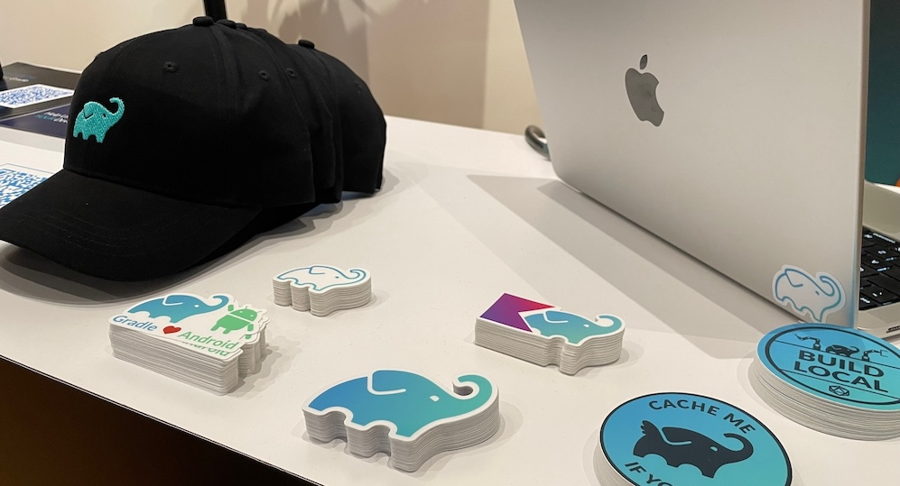

[Hacktoberfest](https://hacktoberfest.com/) is a month-long celebration of open-source projects, their maintainers and contributors.
Many component maintainers from the Gradle ecosystem, such as the
[Gradle plugin for Jenkins](https://plugins.jenkins.io/gradle),
already include their projects in Hacktoberfest.

This year, Gradle is participating in Hacktoberfest!
We are looking forward to collaborating with all contributors on the featured projects, hosting online events for new open-source contributors,
and sending custom Gradle goodies for those who do substantial contributions to the Gradle ecosystem.

## Quick Start

1. Sign-up for Hacktoberfest on [hacktoberfest.com](https://hacktoberfest.com/)
2. Sign-up in [this form for Gradle](https://forms.gle/go2VESj7kDG1QUqV7) so that
  we can contact you and distribute swag
3. Join the `#hacktoberfest` channel on the Gradle Community Slack 
4. Check out the Featured Projects below, and consider joining us for Hacktoberfest events!
5. Enjoy!

## Featured Projects

During Hacktoberfest,
you are welcome to work on any project marked with the `hacktoberfest` topic on GitHub or Gitlab.
Of course, we invite you to work on the following Gradle related projects:
plugins, tools, documentation and examples.

Below, there are a few project ideas we have in mind for the event,
with different levels of complexity:

- **Beginner:** [Learn Gradle](#learn) - Basics, Java, Kotlin
- **Easy:** [Adopt Gradle Best Practices in your GitHub Actions](#github-actions) -
  GitHub Actions, Scripting, Documentation
- **Advanced:** [Configuration Cache Compatibility in Plugins](#configuration-cache) -
  Java, Kotlin, Gradle
- **Easy/Medium:** [Expand the Gradle Cookbook](#cookbook) -
  Documentation, Markdown, tech of your choice
- **Medium:** [Contribute to GradleUp Plugins](#gradleup) -
  Java, Kotlin, Android, Documentation
- **Easy/Medium:** [Improve this Site!](#community-site) -
  MkDocs, Web Design, Documentation

### Adopt Gradle Best Practices in your GitHub Actions

We invite everyone to adopt [Gradle & GitHub Actions best practices](https://community.gradle.org/cookbook/ci/github-actions/).
You can:

* Make them safer by enabling the [Dependency Submission Action](https://github.com/gradle/actions/blob/main/dependency-submission/README.md) to [detect vulnerable dependencies with](https://community.gradle.org/cookbook/ci/github-actions/#detect-vulnerable-dependencies-with-a-dependency-submission-workflow) -
  [How To](https://community.gradle.org/cookbook/ci/github-actions/#detect-vulnerable-dependencies-with-a-dependency-submission-workflow)
* Adopt the [`setup-gradle` action](https://community.gradle.org/cookbook/ci/github-actions/) to enable [Build Caching in your builds](https://community.gradle.org/cookbook/ci/github-actions/#enable-caching-of-downloaded-artifacts)
* Connect them to [Gradle Build Scan](https://docs.gradle.org/current/userguide/build_scans.html) to get better insights and troubleshooting experience - [How To](https://community.gradle.org/cookbook/ci/github-actions/#configure-github-actions)
* Update documentation for the Actions, based on your experiences
  ([GitHub Repo](https://github.com/gradle/actions), [Cookbook Pages](https://community.gradle.org/cookbook/ci/github-actions/))

To tag your patches for Hacktoberfest,
please reference [this ticket](https://github.com/gradle/actions/issues/406)
in the pull requests,
and add the `hacktoberfest` topic.

References:

- [GitHub Repository](https://github.com/gradle/actions)
- Discuss: `#github-integrations` channel on the Community Slack

### Configuration Cache Compatibility in Plugins

In the upcoming Gradle 9.0, we plan to recommend enabling the [Gradle Configuration Cache](https://docs.gradle.org/current/userguide/configuration_cache.html) by default.
It will greatly speed up all aspects of Gradle by caching the Gradle work graph created during the configuration phase.
There have been compatibility issues in plugins,
and some are yet to be discovered and fixed.
Hence, we invite contributors to work on updating the plugin ecosystem,
and to test your builds for Configuration Cache compatibility.

References:

- [List of plugin statuses and open issues](https://github.com/gradle/gradle/issues/13490),
  including known issues up for grabs
- [How To: Fixing Configuration Cache issues](https://github.com/gradle/cc-hackathon-2022/blob/main/faq.md#fixing-configuration-cache-issues)
- Discuss: `#configuration-cache` channel on the Community Slack

### Expand the Gradle Cookbook

We are working on the [Gradle Cookbook](https://cookbook.gradle.org/) - a new community resource with recipes
for cases that are not included in the main Gradle documentation,
including tool integrations, solutions for specific languages, and tech stacks
(e.g. Android), tips on troubleshooting and plugin development.

You are welcome to create new recipes, or to update the existing ones.
For example, we know that some CI recipes are dated, and contributions are needed!

References:

- [Contributing to the Gradle Cookbook](https://community.gradle.org/cookbook/CONTRIBUTING/)
- [Open Issues](https://github.com/gradle/community/issues?q=is%3Aissue+is%3Aopen+label%3Acookbook)
- Discuss: `#docs` channel on the Community Slack

### Contribute to GradleUp Plugins

[GradleUp](https://gradleup.com/) is a new GitHub organization focusing on simplifying Java, Kotlin and Android development with Gradle.
The team nominated a few projects for Hacktoberfest: Shadow Plugin, Static Analysis Plugin, Gratatouille, etc. Contributions to other projects are welcome, too!

References:

- [Contributing to GradleUp](https://gradleup.com/docs/community/participate/)
- [Suggested GitHub Issues](https://github.com/search?q=org%3AGradleUp+is%3Aissue+is%3Aopen+label%3A%22hacktoberfest%22%2C%22help+wanted%22%2C%22good+first+issue%22&type=issues)
- Discuss: `#gradleup` channel on the Community Slack

### Learn Gradle

If you are just starting out with Gradle,
you can learn through common
Java, Kotlin or Android projects.

* Learn Gradle Build Tool with free courses on [DPE University](https://dpeuniversity.gradle.com/app/catalog). Learn Gradle features, create new repositories while learning, and make sure to mark them with `#hacktoberfest`!
* If you see any issues with the documentation or learning materials,
  please submit issues or pull requests.

More advanced users can also experiment with [Declarative Gradle](https://declarative.gradle.org/) and share their feedback.
See the [Getting Started Guide](https://declarative.gradle.org/docs/getting-started/) for the pointers.

To discuss your learning experiences, use the `#docs` channel on the Community Slack.

### Improve the Community Site

We created this community site in early 2024, and there are many improvements to be done!
Improving the look & feel, creating new content, etc...
All patches are welcome!

References:

* [Contributing to the Community Site](./../../../CONTRIBUTING.md)
* [Open Issues](https://github.com/gradle/community/labels/website)

## ¿More Featured Projects?

During the Hacktoberfest, maintainers are welcome to add their project if they provide contributor guidelines and issues that can be worked on by contributors.
If you want to add your project, add a `hacktoberfest` topic to it and submit a pull request to this page.
It counts as a contribution, too :wink:

## Swag

In addition to our Hacktoberfest swag,
we plan to send something nice to those who make substantial contributions to
Gradle Build Tool and its ecosystem.
Make sure to register in [Our Sign-Up Form](https://forms.gle/go2VESj7kDG1QUqV7) so that we can discover your contributions.

## Events

We plan some online events during October, with a goal to help with contributions.
Those events will be recorded:

- **October 02, 14:00 UTC** - Opening Office Hours and Q&A.
  The link will be shared soon.

!!! info

    More events are coming soon!
    We plan a few presentations and office hours for new contributors to open source.

## Stay Informed

Join the `#hacktoberfest` channel on the [Gradle Community Slack](../../../contributing/community-slack.md)
where we will be posting key updates and answering questions.

For future events, subscribe to the [newsletter](https://newsletter.gradle.org/) for updates
about the upcoming community events and mentorship programs,
and also follow them on the `#community-news` channel.
